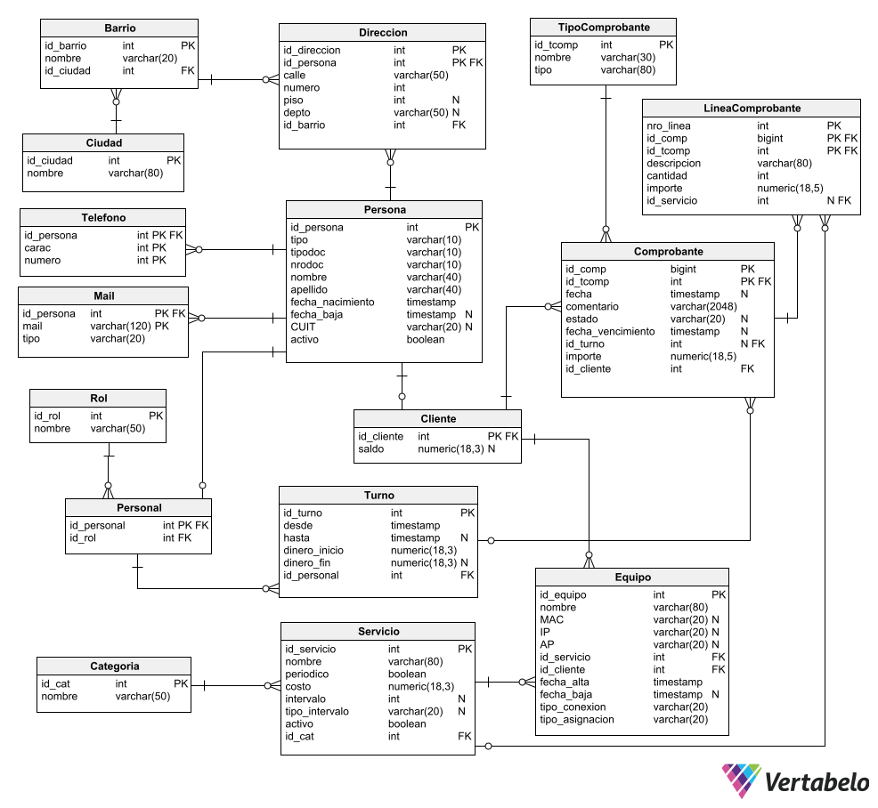

# Sistema de facturacion mensual
---
El sistema fue realizado utilizando el modelo entidad-relación para generar el modelo solicitado, el cual se implemento en PostgreSQL.
---
El sistema ofrece un catalogo de todos los servicios que ofrece. Estos son de 2 tipos: 
- Periodicos(cómo un servicio de telefonia). 
- De cobro unico(cómo una reparación tecnica). 

Permite ofrecer el servicio a distintos clientes distribuidos geograficamente y trabaja con 3 tipos de facturas: 
- Factura: Se detalla en cada linea lo que se esta cobrando.
- Remito: Son documentos entregados a los clientes que luego seran cobrados en la factura siguiente. 
- Recibo: Es el documento que obtiene el cliente luego de abonar la factura.
---
## ¿Como es el proceso de facturacion?
Por cada cliente, se obtienen los servicios periodicos que tenga contratado junto con los remitos del mes anterior y se confecciona una o varias facturas.

**Aclaración: ** *Al generar una factura, los datos son copiados desde los remitos,servicios,etc a la factura en si para evitar que un cambio en el catalogo de servicios produzca un cambio en todas las facturas.*
---

